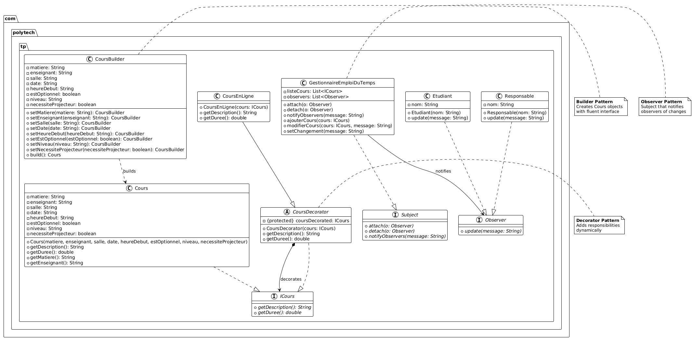

# SIAD - 11

## ✅ Principes Respectés

### 1. **Principe de Responsabilité Unique (SRP)**
- **`CoursBuilder`** : Responsable uniquement de la construction d'objets `Cours`
- **`CoursDecorator`** : Responsable uniquement de l'ajout de fonctionnalités
- **`GestionnaireEmploiDuTemps`** : Responsable uniquement de la gestion des cours et observateurs
- **Interfaces séparées** : `ICours`, `Observer`, `Subject` ont chacune un rôle spécifique

### 2. **Principe Ouvert/Fermé (OCP)**
- **Extensions possibles sans modifications** :
  - Nouveaux décorateurs (`CoursEnAnglais`, `CoursMagistral`) sans modifier `Cours`
  - Nouveaux observateurs sans modifier `GestionnaireEmploiDuTemps`
  - Le code est ouvert à l'extension mais fermé à la modification

### 3. **Principe de Ségrégation des Interfaces (ISP)**
- **Interfaces fines et spécifiques** :
  - `ICours` : uniquement les méthodes essentielles d'un cours
  - `Observer` : seulement la méthode `update()`
  - `Subject` : seulement la gestion des observateurs

### 4. **Principe d'Inversion des Dépendances (DIP)**
- **Abstractions plutôt que implémentations** :
  - Dépend de `ICours` plutôt que de `Cours` directement
  - Dépend de `Observer` plutôt que de `Etudiant`/`Responsable`
  - Les modules de haut niveau ne dépendent pas des modules de bas niveau

### 5. **Principe de Substitution de Liskov (LSP)**
- **Substitution transparente** :
  - `CoursEnLigne` peut remplacer `ICours` partout
  - Tous les observateurs peuvent être utilisés indifféremment
  - Les sous-classes respectent le contrat des parents

## ⚠️ Violations Mineures et Améliorations Possibles

### 1. **Couplage fort dans `CoursBuilder`**
- **Problème** : Connaît tous les détails d'implémentation de `Cours`
- **Amélioration** : Interface `ICoursBuilder` et pattern Director

### 2. **Duplication dans les Observers**
- **Problème** : `Etudiant` et `Responsable` ont des implémentations similaires
- **Amélioration** : Classe abstraite `BaseObserver` avec comportement commun

# Diagramme de Classes

*Diagramme UML montrant l'implémentation des patterns Builder, Observer et Decorator*
